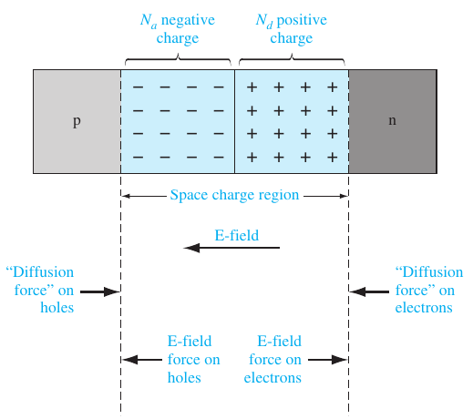
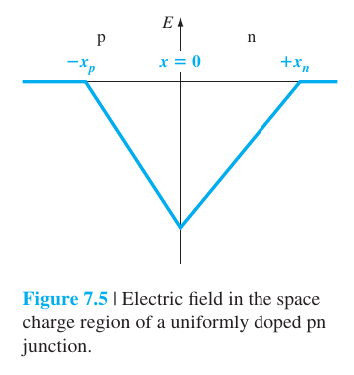
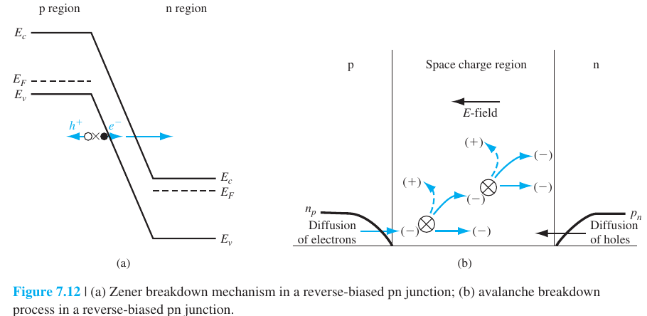
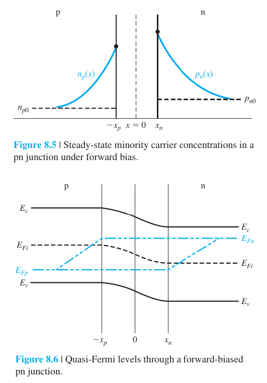
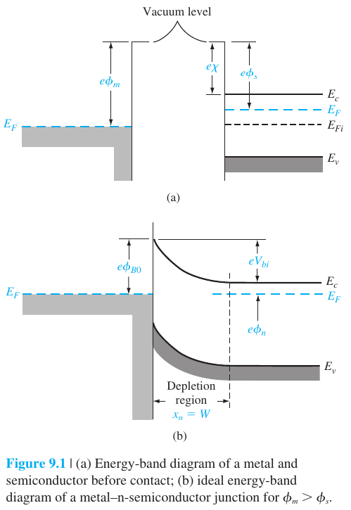

# Semiconductor devices review questions

test 2 prep explanation questions

## Define built-in potential and describe how it maintains thermal equilibrium

- equilibrium potential voltage across p-n junction created by electric field that forms when majority carriers diffuse across the junction, leaving ions in the depletion region. 
- oppositely charged ions on each side induces the electric field.
- net current is zero under thermal equilibrium:
    - from the above figure, two opposing actions
    - diffusion: holes to n side, electrons to p side (high conc -> low conc)
    - drift: induced electric field pulls carriers to opposite charged region (holes to p side, electrons to n side space charge region)
- $V_{bi}$ creates potential barrier that prevents net movement of majority carriers across the junction.
- %V_{bi}$ shifts energy band on n side down and p side up relative to each other to ensure fermi levels align.

### comment:
- $V_{bi}$ changes only slightly as doping concentrations change by orders of magnitude due to the logarithmic dependence.

### Why can you not measure the built-in potential with a voltmeter?

new potential barriers will be formed between the probes and the semiconductor that will cancel out $B_{bi}$. The built-in potential maintains equilibrium, so no current is produced by this voltage. As if there was, energy could come out of nowhere which would violate conservation of energy.

### Built in electric field

comments:
- doping concentration of each side proportional to magnitude of slope of E/x graph
- negative of derivative of the potential graph ($\xi = - \frac{1}{q} \frac{d V}{d x}$)

## Why is the space charge width smaller on one side of the pn junction?

On the more heavily doped side the space charge width will be smaller as the volume carrier density is higher, hence only a smaller length of material is required to have the same magnitude of charge as the lesser doped side.

## Why does capacitance exist in a reverse biased junction? Why does capacitance decrease with increasing reverse bias voltage?

A capacitance exists because a change in the applied voltage causes a change in the amount of charge in the depletion region. Due to the mathematical relationship $ C = \frac{d Q}{d V} $, which states that capacitance is the rate of change of charge with respect to voltage, the capacitance is nonzero with an applied reverse voltage.

Junction capacitance is similar to capacitance in a parallel plate capacitor. Increasing the reverse bias voltage increases the depletion region width, and because $ C_j = \frac{\epsilon A}{W} $, increasing V decreases $C_j$. 

### comment:
- FORWARD BIAS: $C_j <<  C_s$
    - depletion width is very small, making $C_j$ larger, but this is still small in comparison to $C_s$ as it only increases sqrt-ly.
    - lower potential barrier, minority carrier injection is large; these carriers take time to recombine, causing storage capacitance. Carrier concentration increases exponentially with forward voltage, $C_s$ increases.
- REVERSE BIAS: $C_j >> C_s$
    - depletion width increases, decreases $C_j$, but rather slowly (sqrt).
    - potential barrier too high, minority carrier extraction -> no injected charge, no storage capacitance. Hence it is negligible compared to $C_j$.

## Why does the breakdown voltage of a pn junction decrease as doping concentration increase?

1. Avalanche breakdown: $V_{br}$ inversely proportional to doping concentration of lowly doped side. Higher doping causes the maximum electric field to reach the critical electric field at lower applied voltage.
2. Zener breakdown: higher doping concentration causes the depletion width to become narrower, making the energy barrier narrower and thus increasing the probability of the electron tunneling through the energy barrier. 

### Describe the two breakdown mechanisms

1. Avalanche breakdown:
    - occurs at high applied voltage, when induced electric field becomes large enough that it accelerates carriers to high speeds. These carriers then come into contact with other carriers, transferring some of their kinetic energy to those carriers and allowing them to break out of their respective positions. This results in a positive feedback loop where the displaced carriers go on to free more carriers each like a snowball rolling down a hill (hence the avalanche analogy).
2. Zener breakdown
    - occurs when voltage drop across the junction is too large such that the valence band edge of the p side becomes higher than the conduction band of the n side. As there are now empty states in the n-side conduction band for the electrons in the p-side valence band to tunnel to, there is a nonzero probability that quantum tunneling occurs. This probability is also affected by: depletion width

## So what happens to majority carriers in depletion region?

Majority carriers diffuse to other side of the junction, leaving behind a region of space charge (depletion region). In this region, majority carrier concentration is negligible, leaving behind immobile impurity ions which cannot conduct.

Majority carriers that diffuse to the other side are eliminated by electron-hole pair recombinations. Net result: diffused carriers disappear. 

2 reasons for lack of carriers in space charge region:
1. diffusion of majority carriers to the other side
2. recombination of injected carriers from the other side with majority carriers on this side

**Called "depletion zone" for a reason.**

Net negative region on p side, net positive region on n side. 

## Temperature dependence of reverse saturation current

$$ I_0 = q A (n_i^2) (\frac{D_n}{L_n N_a} + \frac{D_p}{L_p N_d}) $$

$$ n_i^2 = N_c N_v \exp(-\frac{E_g}{k_B T}) $$

The greater the temperature, the greater the intrinsic carrier concentration, and hence the greater the reverse saturation current. 

(As temperature increases, electrons gain more thermal energy and thus more covalent bonds are broken, increasing number of electron hole pairs)

## Storage (diffusion) capacitance and resistance

significant only under forward current conditions. When forward voltage is applied, majority carriers injected across depletion region into other side and becomes excess minority carriers in the quasi neutral regions. Due to exponential relationship, small change in voltage leads to large change in number of excess carriers injected. Requires finite amount of time for carriers to be transported -> large number of charge, larger $\frac{d Q}{d V}$, hence larger $C_s$.

## Explain the physical mechanism of the generation current and recombination current.

1. Thermal generation current(under reverse bias); primary component of reverse current and arises from thermal generation of electron-hole pairs in the depletion region. 
2. Recombination current(under forward bias); major component of forward current that arises from injected minority carriers recombining with abundant majority carriers in bulk material

## If a forward based pn junction is switched off, what happens to the stored minority carriers? In which direction is the current immediately after the diode is switched off?

Piled up minority carriers at the depletion region edges, after the bias is switched off, the built in electric field will pull the excess carriers to the other side ($\Delta p_{n}$ to p side, $\Delta n_{p}$ to n side). Hence there is a drift current that directs from the n side to p side (reverse current).

after bias removed  
minority carriers recombines with majority carriers on that side  
drift force = diffusion force 

## Why does reverse saturation current exist?

constant thermal generation of electron hole pairs.
- any minority carrier thermally generated within the depletion region or within one diffusion length away from it will move to the junction
- form drift current as they are moved by the electric field

called 'reverse saturation current' because it is limited by the minority carrier concentration (independent of voltage)

$$ I_0 = q A (\frac{D_p}{L_p}p_{n0} + \frac{D_n}{L_n} n_{p0}) $$

## What is the mechanism of charge flow in forward-biased schottky diode?

Majority carrier current.

## Why is the reverse saturation current of a schottky diode so much higher than pn junction?

Schottky diodes are majority carrier devices. Its current is dependent on the thermionic emission of majority carriers over the depletion region, 

## Difference in switching characteristics between pn and schottky diode? Storage charge behaviour?

Schottky diodes have a much faster switching time than pn junctions as its current is due to majority carriers and hence there is no storage capacitance due to minority carrier pile up.

## Why is the barrier in an ohmic contact low? schottky contact vs ohmic contact

schottky contact: depletion region on semiconductor. Eg n-type schottky contact: electrons flow from semiconductor to metal, region with uncompensated donor atoms are formed -> rectifying behaviour

ohmic contact: no depletion region. Instead there is a highly conductive region near the junction. Eg n-type ohmic contact, metals overall positive, semiconductor has excess electrons -> increasing charge density -> increasing conductivity. p type: metal overall negative, etc...

in ohmic p-type:
- 

## What happens to the fermi levels of the metal and semiconductor in a schottky contact?

the energy levels in the metal do not shift. the energy bands and fermi level of the semiconductor shifts to that of the metal's.
- reason: density of carriers in metal is magnitudes greater than that of the semiconductor's. Effects of carriers between the two materials on their fermi levels are negligible on the metal, as compared to the semiconductor.

## Why is there a bending of the band diagram on the semiconductor side?

in schottky n-type contact: 
- metal overall negatively charged, semiconductor overall positively charged
- in order to move closer to the metal, the electrons in the semiconductor requires higher potential