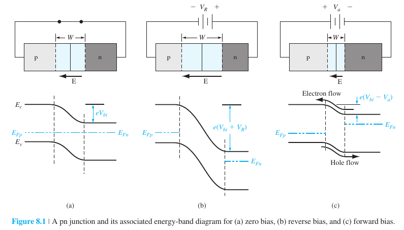
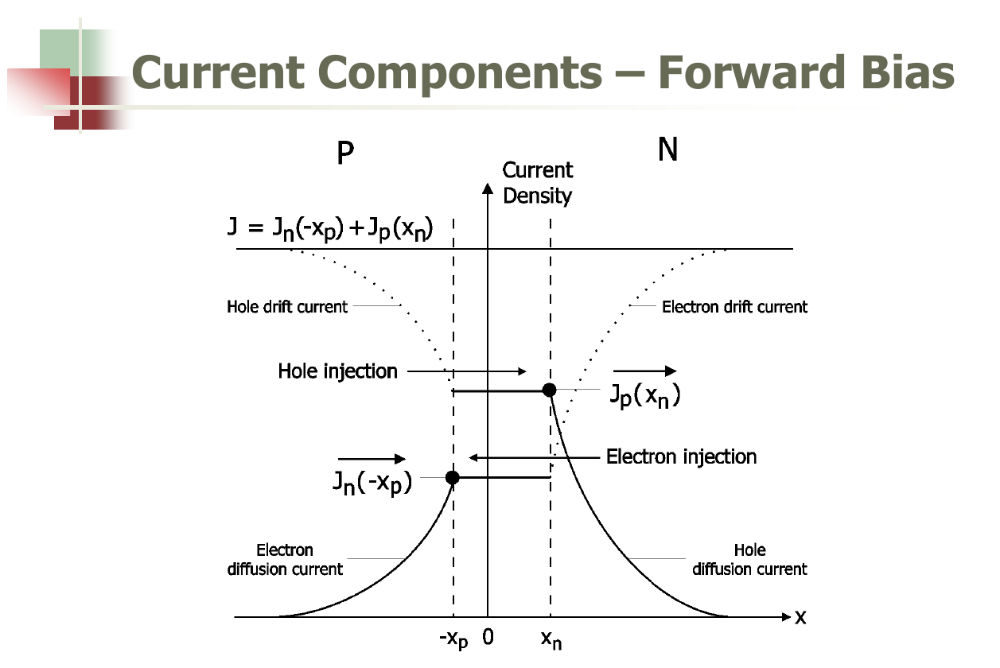
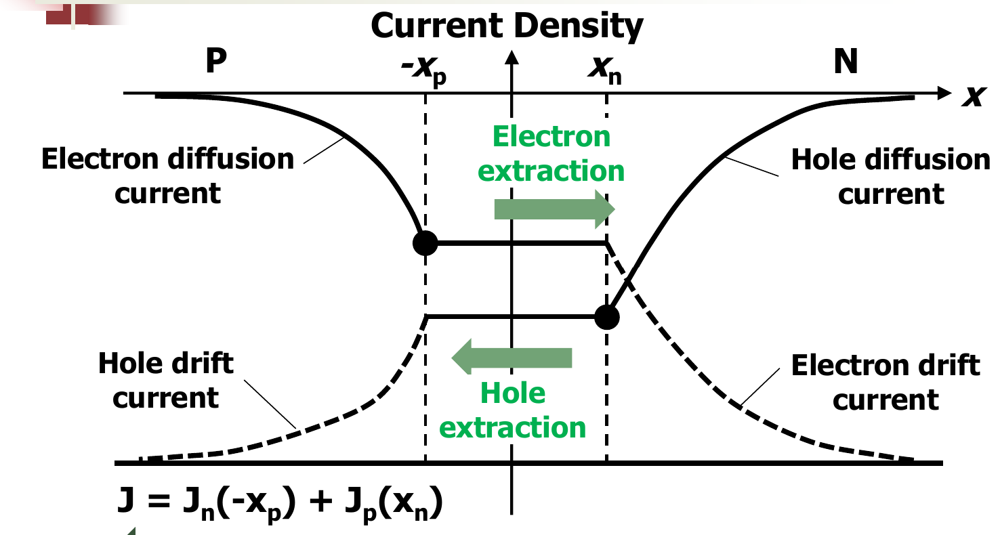

# Important things to know

## About the movement of electrons vs holes

It is imperative to note that while every resource has taught us to treat holes as a carrier similar to an electron just with the opposite charge, a hole is just ultimately the absence of an electron. (Okay, this is physically true as the hole carries a positive effective mass and behaves exactly like a particle still).

The band edges hold the lowest energy states possible for the carriers of that band. The conduction band edge: lowest possible energy electron carriers. Valence band edge: lowest possible energy hole carriers.

In the energy bands:
- electrons move towards a region of lower conduction band energy (roll downhill)
- holes move towards region of higher valence band energy (float upwards)

## Potential barrier

Under thermal equilibrium, it only means there is no net movement of carriers and thus no net current. But in a pn junction, for example, this only means the diffusion current of holes -> n region/electrons -> p region is equal to the drift current of holes -> p region/electrons -> n region.

Potential barrier does not mean the carriers physically cannot move across it at all. It only sets up the electric field that establishes the drift current which balances out the diffusion current, ensuring net zero carrier movement. So actually there is always some movement of charges, just they cancel each other out.

Applying a forward bias decreases the built-in potential barrier, which decreases the electric field that causes the net drift current to decrease. Hence, diffusion > drift, and there is now a net movement of charges -> current.

## Forward bias vs reverse bias

### Forward bias
- minority carrier injection
- dominant current: majority carrier diffusion
- smaller electric field, more majority carriers possess sufficient energy (from thermal generation) to overcome potential barrier
- lowered potential barrier, majority carriers of each side diffuse to the other side -> minority carrier concentration exponentially increases at depletion region edges with decrease of potential barrier
- large forward current due to diffusion of large number of majority carriers

### Reverse bias
- minority carrier extraction
- dominant current: minority carrier drift
- increased potential barrier -> increased electric field, drift of electrons and holes to respective n and p regions increases. -> minority carrier concentration decreases at depletion region edges.
- diffusion of majority carriers decrease to negligible amounts due to smaller number of carriers having sufficient energy to overcome higher potential barrier
- negligible backward current due to drift of small number of minority carriers

**transport (diffusion) of minority carriers in the respective quasi-neutral n and p regions determines the amount of current flow in the diode at a given bias.**

## Depletion region in schottky contacts

**Carrier density**  
electrons in region with higher $E_f$ flows to region with lower $E_f$. As metal possesses multiple greater magnitudes of number of free electrons, depletion region is essentially zero and only a layer of surface charge is formed on the metal. In the semiconductor, however, the depletion region is formed due to uncompensated donor/acceptor ions.
- additionally, as electrons are free moving in metal, voltage drop across it is zero (equipotential region), while for the semiconductor the electric field would occur across the space charge region.
- analogous to a one-sided $p^+n$ junction, for metal - n type semiconductor contacts.

## metal-semiconductor contacts

## Comparison between a schottky barrier diode and a pn junction diode

### reverse saturation current

- different current mechanisms
    - schottky diodes current determined by thermionic emission of majority carriers over potential barrier
    - pn diode current determined by diffusion of minority carriers

**thermionic emission**:
- due to carriers gaining enough thermal energy to jump the potential barrier in schottky diode. 
- as magnitude of majority carrier concentration is very large, thermionic emission is more frequent and results in larger reverse saturation current.
- drift current (diffuse to n side)